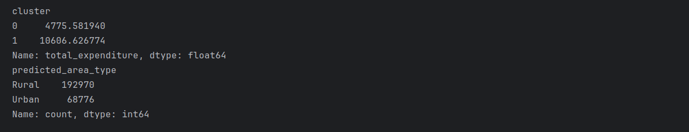
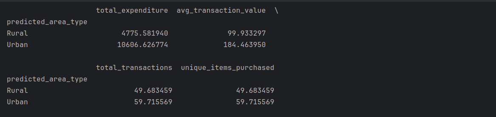
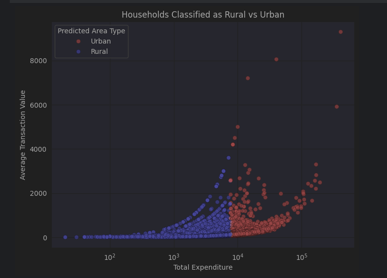
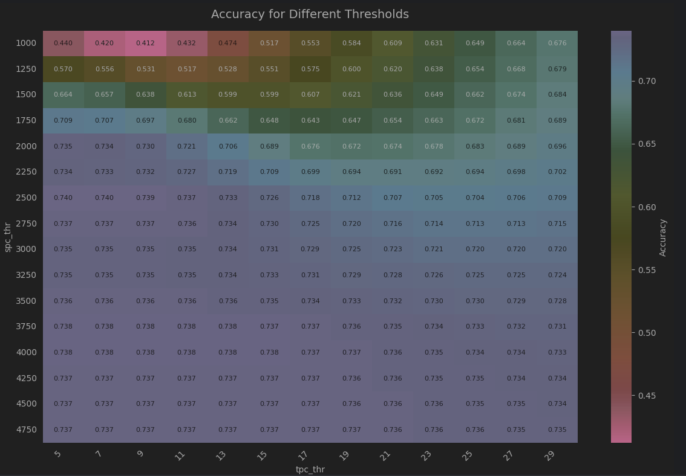

<!-- Header badge examples -->


# Clustering Households into Rural and Urban Segments using Spending Patterns — Exploratory Data Analysis

This repository hosts an in-depth **Exploratory Data Analysis (EDA)** on the Ground Truth Household dataset, aimed at uncovering patterns in household expenditure, transaction behavior, and sector-wise trends.

The analyses are performed in the Jupyter Notebook: `eda_ground_truth_households.ipynb`

---

##  Overview

This EDA project follows a structured pipeline:

1. **Data Loading & Cleaning**  
2. **Descriptive Statistics & Distribution Analysis**  
3. **Sector-based Comparative Visuals**  
4. **Correlation Analysis**  
5. **Clustering & Pattern Discovery**

Visualizations include histograms, boxplots, scatterplots, and heatmaps to illustrate key insights.
Performing unsupervised learning using the KMeans clustering algorithm to classify households into two segments — likely Rural and likely Urban — based on spending and transaction behavior.
he dataset contains household-level parameters:

    Total expenditure
    Average transaction value
    Total transactions
    Unique items purchased


---

##  Quickstart

Get up and running in a few minutes:

```bash
git clone https://github.com/11saishiva/eda-ground-truth-households.git
cd eda-ground-truth-households
```

###  Environment Setup

```bash
python -m venv venv
source venv/bin/activate        # macOS / Linux
venv\Scripts\activate           # Windows

pip install -r requirements.txt
```
###  Run the Notebook

```bash
jupyter notebook eda_ground_truth_households.ipynb
```
---

##  Dataset

###  Key variables:

1. **total_expenditure:** Overall spending per household
2. **avg_transaction_value:** Average amount per transaction
3. **total_transactions:** Number of transactions per household
4. **common_id:** Unique ID for each household

---

##  Insights & Findings

->  Households in different sectors exhibit varying spending distributions.
->  Average transaction values correlate strongly with total expenditure.
->  Clustering analysis reveals distinct behavior groups based on transaction patterns.

---

##  Model performance metrices



###  Mean values of variables with respected to predicted Area type (Rural or Urban)



---

##  Parameters used

->  spend_per_capita threshold range = total_expenditure/household_size

->  transactions_per_capita threshold range = total_transactions/household_size

---

##  Visualization

Scatterplot visualizing the households classified as Rural or Urban - Predictions



Accuracy of spend_per_capita threshold and transactions_per_capita threshold represented as a heatmap



---

##  License

This project is shared under the MIT License. Feel free to use, modify, and distribute freely.

---
